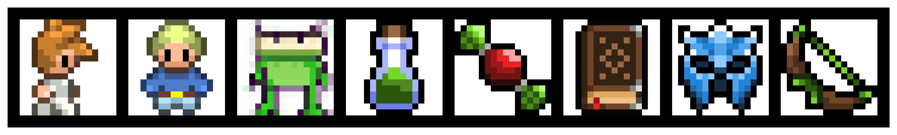
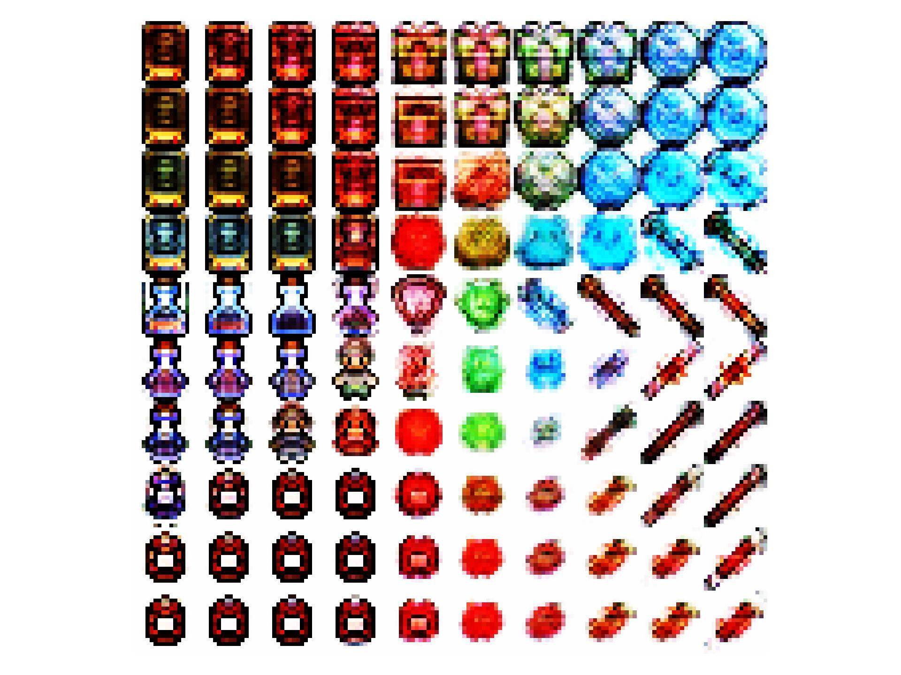

# Hackathon starting kit - Diffusion models from scratch



In this hackathon, we will build diffusion models from scratch. The data we will use are sprites taken from Aasa Feragen's *Advanced Deep Learning in Computer Vision* course (which in turn seems to be taken from [Ryota Kawamura's introduction to diffusion models](https://github.com/Ryota-Kawamura/How-Diffusion-Models-Work)).

## Setting up your environment

Create a fresh conda environment for this project

```bash
conda create -n diff python=3.10
```

After this, activate the environment and install the requirements:

```bash
conda activate diff
pip install -r requirements.txt
```

Remember to **add the current folder to your PYTHONPATH**. In `vscode`, you can do this by adding this to your `launch.json`:

```
"env": {
    "PYTHONPATH": "${workspaceFolder}"
},
```

## Loading up the data

As soon as you have the root folder on your PYTHONPATH, you should be able to run

```python
from utils.data.dataloaders import get_train_and_test_dataloaders

# Two torch dataloaders with train and test.
train_data_loader, test_data_loader = get_train_and_test_dataloaders(
    batch_size=...,
    test_split=...,
    seed=...,
)
```

## Simple baselines

We provide a simple VAE both in `torch` and in `jax`. You can find them under `baselines`.

Here's the latent space of a VAE overfitted to only 1000 sprites:



## Gotchas

Jax and Pytorch have [incompatible CUDA requirements](https://github.com/google/jax/issues/18032). Unfortunately, this means you can not install both Jax and Pytorch compatible gpu version. If you wish to use Jax, you will have to use the CPU version of Pytorch. The requirements.txt file assumes you are using the CPU version of Jax.

If you wish to use JAX on GPU run the following:

```bash
conda create -n diff python=3.10
conda activate diff
pip install -r requirements_jaxgpu.txt
```